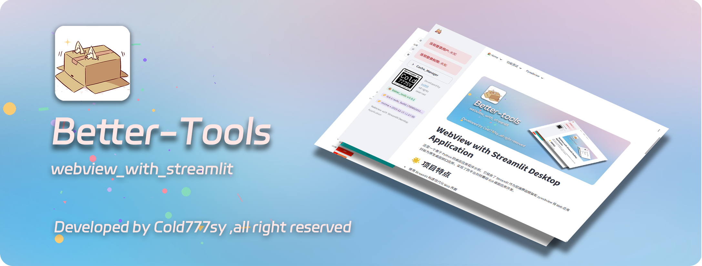

# WebView with Streamlit Desktop Application

这是一个基于 Python 的桌面应用程序示例，它结合了 Streamlit 作为前端界面框架和 pywebview 将 Web 应用封装为原生桌面窗口应用，实现了跨平台的轻量级 GUI 桌面应用开发。

## 🌟 项目特点

- 使用 Streamlit 构建现代化 Web 界面
- 通过 pywebview 将 Web 应用封装为桌面应用
- 集成 FastAPI 后端服务
- 支持打包为独立的可执行文件
- 跨平台支持 (Windows/macOS/Linux)

## 🏗️ 技术架构

- **前端**: Streamlit + HTML/CSS/JavaScript
- **后端**: FastAPI
- **桌面封装**: pywebview
- **打包工具**: PyInstaller
- **项目管理**: pyproject.toml

## 🚀 快速开始

### 安装依赖

```bash
# 创建虚拟环境（推荐）
uv sync
```

### 开发模式运行

```bash
uv run main.py
```

这将启动三个组件：
1. Streamlit 服务 (端口 8501)
2. FastAPI 服务 (端口 8000)
3. WebView 窗口显示应用界面

### 打包为可执行文件

```bash
# 安装开发依赖
uv run  auto_build.py

# 将自动使用 PyInstaller 打包
```

打包后的可执行文件位于 `dist/` 目录中。

## 📁 项目结构

```
.
├── main.py                 # 应用主入口
├── auto_build.py           # 自动构建脚本
├── updater.py              # 更新脚本
├── pyproject.toml          # 项目配置文件
├── src/
│   ├── app/
│   │   └── start_app.py    # 应用启动逻辑
│   ├── fast_api/           # FastAPI 后端服务
│   │   ├── fastapi_app.py
│   │   └── api/v1/
│   ├── ui/                 # Streamlit UI 组件
│   │   ├── sidebar.py
│   │   └── pages/
│   └── test/
├── assets/                 # 静态资源文件
└── logs/                   # 日志目录
```

## 🧩 功能模块

### 主要页面

1. **主页** - 欢迎页面
2. **功能测试** - 测试页面集合

### 核心功能

- 用户认证状态显示
- 缓存管理
- 窗口大小调整 API
- 多页面导航

## ⚙️ 配置说明

应用使用以下端口：
- Streamlit: 38501
- FastAPI: 38000

## 🛠️ 开发指南

### 添加新页面

1. 在 `src/ui/pages/` 下创建新的目录
2. 添加页面文件（如 `new_page.py`）
3. 在 `src/ui/pages/__init__.py` 的 [PAGES] 列表中添加新页面

### 添加新的 API

1. 在 `src/fast_api/api/v1/` 下创建新的模块
2. 在 `src/fast_api/api/v1/main.py` 中引入并注册路由

## 📄 许可证

