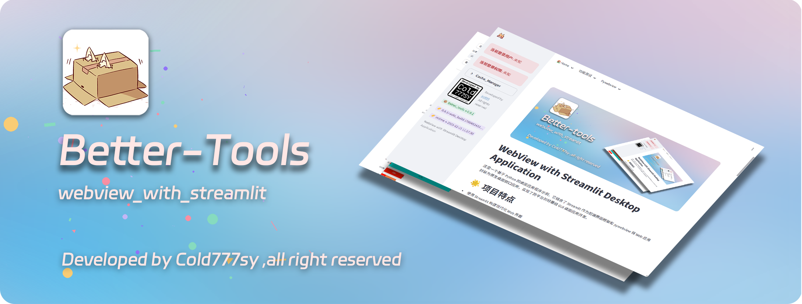

README.md



# WebView with Streamlit Desktop Application

这是一个基于 Python 的桌面应用程序示例，它结合了 Streamlit 作为前端界面框架和 pywebview 将 Web 应用封装为原生桌面窗口应用，实现了跨平台的轻量级 GUI 桌面应用开发。

## 🌟 项目特点

- 使用 Streamlit 构建现代化 Web 界面
- 通过 pywebview 将 Web 应用封装为桌面应用
- 集成 FastAPI 后端服务
- 支持打包为独立的可执行文件
- 跨平台支持 (Windows/macOS/Linux)

## 🏗️ 技术架构

- **前端**: Streamlit + HTML/CSS/JavaScript
- **后端**: FastAPI
- **桌面封装**: pywebview
- **打包工具**: PyInstaller
- **项目管理**: pyproject.toml

## 🚀 快速开始

### 安装依赖

```bash
# 创建虚拟环境（推荐）
uv sync
```

### 开发模式运行

```bash
uv run main.py
```

这将启动三个组件：
1. Streamlit 服务 (端口 8501)
2. FastAPI 服务 (端口 8000)
3. WebView 窗口显示应用界面

### 打包为可执行文件

```bash
# 构建应用
uv run auto_build.py

# 将自动使用 PyInstaller 打包
```

打包后的可执行文件位于 `dist/` 目录中。

## 📁 项目结构

```
.
├── main.py                 # 应用主入口
├── auto_build.py           # 自动构建脚本
├── updater.py              # 更新脚本
├── pyproject.toml          # 项目配置文件
├── CHANGELOG.md            # 版本变更日志
├── README.md               # 项目说明文档
├── src/
│   ├── app/
│   │   ├── __init__.py
│   │   ├── app_info.py     # 应用信息
│   │   ├── app_utils.py    # 应用工具
│   │   ├── hidden_import.py # 隐藏导入（打包用）
│   │   └── start_app.py    # 应用启动逻辑
│   ├── fast_api/           # FastAPI 后端服务
│   │   ├── api/v1/
│   │   │   └── main.py     # API 主路由
│   │   └── fastapi_app.py  # FastAPI 应用实例
│   ├── manager/            # 插件管理器
│   │   └── plugins_manager.py
│   ├── ui/                 # Streamlit UI 组件
│   │   ├── __init__.py
│   │   ├── sidebar.py      # 侧边栏组件
│   │   ├── streamlit_app.py # Streamlit 主应用
│   │   ├── test.py         # 测试页面
│   │   ├── window.py       # 窗口控制
│   │   ├── pages/          # 页面组件
│   │   └── utils/          # UI 工具函数
│   └── utils/              # 通用工具函数
│       ├── __init__.py
│       ├── config_manager.py # 配置管理
│       └── config_reader.py  # 配置读取
├── plugins/                # 插件目录示例
├── assets/                 # 静态资源文件
│   ├── config.json         # 应用配置
│   └── latest.json         # 最新版本信息
├── test/                   # 测试文件
└── logs/                   # 日志目录（如果启用）
```

## 🧩 功能模块

### 主要页面

1. **主页** - 欢迎页面
2. **功能测试** - 测试页面集合 (Test A, Test B)

### 核心功能

- 用户认证状态显示
- 缓存管理
- 窗口大小调整 API
- 多页面导航
- 插件管理 (实验性)
- 应用更新检查

## ⚙️ 配置说明

应用使用以下端口：
- Streamlit: 8501
- FastAPI: 8000

> 注意：在某些情况下，端口可能会自动调整为其他可用端口，如 38501 和 38000。

## 🛠️ 开发指南

### 添加新页面

1. 在 `src/ui/pages/` 下创建新的目录
2. 添加页面文件（如 `new_page.py`）
3. 在 `src/ui/pages/Home/` 或 `src/ui/pages/Test/` 中添加页面入口

### 添加新的 API

1. 在 `src/fast_api/api/v1/pywebview/` 下创建新的模块
2. 在 `src/fast_api/api/v1/main.py` 中引入并注册路由

### 自定义 UI 组件

1. 在 `src/ui/utils/` 中添加自定义组件
2. 参考 [streamlit's api-reference](https://docs.streamlit.io/develop/api-reference)
## 🧪 测试

运行单元测试：
```bash
uv run pytest test/
```

## 📦 发布

每次发布前，请确保：
1. 更新 `CHANGELOG.md` 中的版本记录
2. 更新 `assets/latest.json` 中的版本信息
3. 运行所有测试确保功能正常
4. 执行 `uv run auto_build.py` 创建新版本

## 🤝 贡献

欢迎提交 issue 和 pull request！在提交之前，请确保：
1. 代码遵循 PEP8 规范
2. 添加适当的测试
3. 更新相关文档

